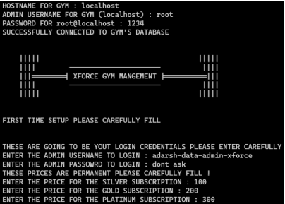
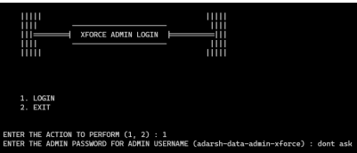
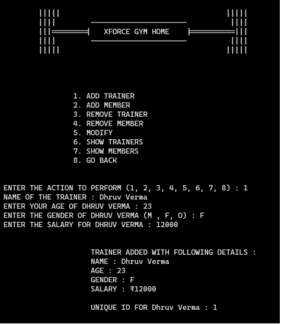
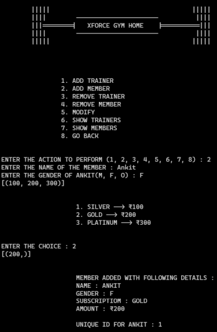

# GYM MANAGEMENT SYSTEM
## This is a project **Our Group** made in **January 2023** for our **Practical Examinations**. **UI** even though this is a **TERMINAL BASED** software is much better which has been done by using the `tabulate` module which we will talk about later, we thought of having GUI by using `tkinter` but we didn't got enough time to implement it. 
### **IF YOU CAN PLEASE CONTRIBUTE TO THIS PROJECT BY USING `tkinter` OR ANY OTHER GUI LIBRARY OF PYTHON**

# USAGE
- We will need **PYTHON** ofcourse, which can be downloaded from [python.org](https://python.org)
- We will need **MYSQL**, which can be downloaded from [MySQL.com](https://mysql.com)
- We will need some python libraries which can be installed using 
`pip install mysql-connector-python tabulate`

# You can go to the **OUTPUT** section in the PDF attached for more **IMAGES**

